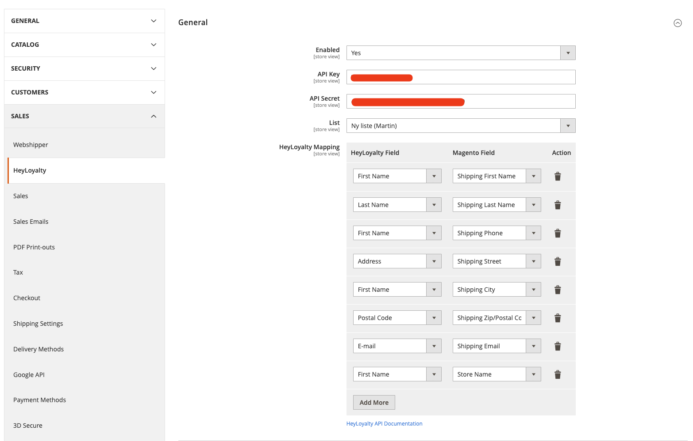
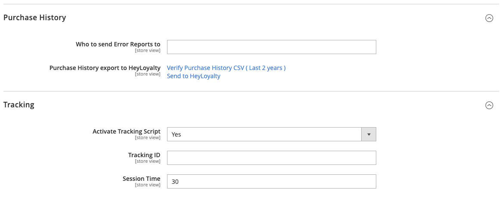

# HeyLoyalty Module

## Settings

#### General Settings

On first setup no lists or mappings will be available. Once you have entered your `Api Key` and `Api Secret` (Hit the save button) your lists and fields will be available for editting



#### Purchase History and Tracking

If you want to provide HeyLoyalty with the last 2 years of orders you can use the `Send To HeyLoyalty` button to trigger an order import

If you want to verify the data before you send it, you can click the first link (`Verify Purchase History CSV (Last 2 years)`) This will download a CSV file where you can verify the data before submitting it.




## Developer Guide:

### Setup

`php bin/magento setup:upgrade` is all that is required to install the module.

The module has a few dependencies on internal magento modules:
```xml
<sequence>
    <module name="Magento_Newsletter"/>
    <module name="Magento_Customer"/>
    <module name="Magento_Store"/>
</sequence>
```
These are all required by magento by default

### API, Client & Config

The 3 main important files in this project are present in `HeyLoyalty/Model` folder

- `HeyLoyaltyApi`
- `HeyLoyaltyClient`
- `HeyLoyaltyConfig`

The `HeyLoyaltyApi` is a wrapper around the client and handles all Magento specific context and passes the data unto the client.
`HeyLoyaltyClient` is a 1:1 mapping of the HeyLoyalty Api documentation, most of the methods in this class are not used in this method, but was made incase we needed access to them. You can see [HeyLoyalty Api Documentation](https://github.com/Heyloyalty/api/wiki) for available methods and required parameters

The `HeyLoyaltyConfig` class is used to fetch all the configurations from magento, it provides an easy way to get the correct store settings.

### Purchase History 

Due to the many ways Magento can be configured and setup the decision to make a csv file was instead moved into a controller action. This means we can manipulate the contents at runtime and provide an up to date file at any given moment. 

We also avoid running into issues with File permissions, some Magento installations have very strict file permissions schema preventing modules from creating files on the disk.

At the settings page there are 2 links, one to download the file and one to trigger an import via HeyLoyalty Api.
- HeyLoyalty/Controller/Adminhtml/PurchaseHistory/MarkForExport.php
- HeyLoyalty/Controller/PurchaseHistory/CsvExport.php

We have two controllers, one Admin and one Frontend
The frontend controller needs to be supplied with a security key in order for it to return data (GDPR & Security reasons). A key can be generated using the `\Wexo\HeyLoyalty\Api::generatePurchaseHistorySecurityKey` method

### Tracking

Tracking is done via Frontend Layouts `view/frontend/layout/default.xml` here we create a Magento Block and in order to add HTML to the magento theme. Using the default.xml we are most likely to add it to the current theme. There are instances of custom modules overwriting the entire Magento theme causing this to not work.

If a client happens to use one of those modules, they will need to manually attach the model

It can be done by adding the following Block XML to a layout:

```xml
<block class="Magento\Framework\View\Element\Template"
        name="wexo_heyloyalty_script"
        template="Wexo_HeyLoyalty::tracking_script.phtml">
    <arguments>
        <argument name="view_model" xsi:type="object">Wexo\HeyLoyalty\ViewModel\Tracking</argument>
    </arguments>
</block>
```

The ViewModel is responsible to fetching the data made available to the template

`\Wexo\HeyLoyalty\ViewModel\Tracking`

Using the built in methods from Magento we can fetch relevant information and build our own context. This is relevant because HeyLoyalty has requirements for when specific events are triggered and what data is sent

All the tracking is handled in the `HeyLoyalty/view/frontend/templates/tracking_script.phtml` file. All the events and their parameters are taking from the documentation provided at [HeyCommerce Tracking Documentation](https://support.heyloyalty.com/hc/en-us/articles/360020072411-9-2-Dokumentation-Heycommerce-produkt-tracking)

The only special case we handle is when a user triggers the `add_to_cart` event
This is event is by default handled via Knockout

The specific code is this part. This adds a dependency on the Magento platform utilizing the built in Knockout (which is default).


```html
<script>
    require(['Magento_Customer/js/customer-data'], function(customerData) {
        let cart = customerData.get('cart');
        cart.subscribe(function() {
            ...
        })
    });
</script>
```
_HeyLoyalty/view/frontend/templates/tracking_script.phtml:116_

This again means that if the client uses a different theme which removes this dependency then they will have to implement the add_to_cart event themselves.
